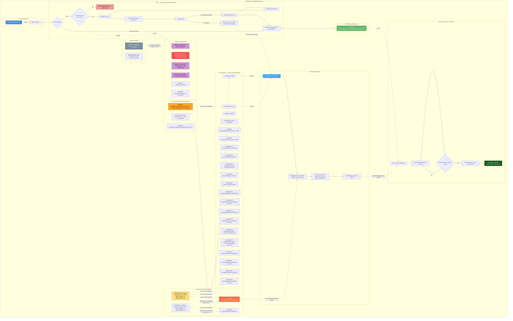

```mermaid
graph TB
    subgraph repo["Repository: saistemplateprojectrepo"]

        subgraph devwf["Developer Workflow"]
            DEV["Developer / Claude Code"]
            CB["claude/* branch"]
            DEV -->|push| CB
        end

        subgraph cicd["CI/CD — auto-merge-claude.yml [template]"]
            TRIGGER{"Push to claude/*?"}
            CB --> TRIGGER
            TRIGGER -->|Yes| SHA_CHECK{"Commit SHA = last-processed?"}
            SHA_CHECK -->|Yes| DELETE_STALE["Delete inherited branch - skip merge"]
            SHA_CHECK -->|No| MERGE["Merge into main"]
            MERGE --> UPDATE_SHA["Update last-processed-commit.sha"]
            UPDATE_SHA --> DIFF["Check git diff"]
            DIFF -->|live-site-pages changed| PAGES_FLAG["pages-changed = true"]
            DIFF -->|.gs changed| GAS_DEPLOY["Deploy GAS via curl POST to doPost action=deploy"]
            GAS_DEPLOY --> DELETE_BR
            MERGE --> DELETE_BR["Delete claude/* branch"]
            PAGES_FLAG --> DEPLOY_PAGES
            TRIGGER -->|Direct push to main| DEPLOY_PAGES
        end

        subgraph ghpages["GitHub Pages Deployment"]
            DEPLOY_PAGES["Deploy live-site-pages/ to GitHub Pages"]
            LIVE["Live Site - ShadowAISolutions.github.io/saistemplateprojectrepo"]
            DEPLOY_PAGES --> LIVE
        end

        subgraph livepages["live-site-pages/ — Hosted Content [template]"]
            NOJEKYLL["[template] .nojekyll"]
            INDEX["[template] index.html"]
            TEST_PAGE["[template] test.html"]
            GASTPL_PAGE["[template] gas-project-creator.html"]
            SND1["[template] sounds/Website_Ready_Voice_1.mp3"]
            SND2["[template] sounds/Code_Ready_Voice_1.mp3"]
            VERTXT["[template] html-versions/indexhtml.version.txt"]
            TEST_VERTXT["[template] html-versions/testhtml.version.txt"]
            GASTPL_VERTXT["[template] html-versions/gas-project-creatorhtml.version.txt"]
            INDEX_GSVER["[template] gs-versions/indexgs.version.txt"]
            TEST_GSVER["[template] gs-versions/testgs.version.txt"]
            INDEX_CL["[template] html-changelogs/indexhtml.changelog.md"]
            INDEX_CL_ARCH["[template] html-changelogs/indexhtml.changelog-archive.md"]
            TEST_CL["[template] html-changelogs/testhtml.changelog.md"]
            TEST_CL_ARCH["[template] html-changelogs/testhtml.changelog-archive.md"]
            GASTPL_CL["[template] html-changelogs/gas-project-creatorhtml.changelog.md"]
            GASTPL_CL_ARCH["[template] html-changelogs/gas-project-creatorhtml.changelog-archive.md"]
            INDEX_GCL["[template] gs-changelogs/indexgs.changelog.md"]
            INDEX_GCL_ARCH["[template] gs-changelogs/indexgs.changelog-archive.md"]
            TEST_GCL["[template] gs-changelogs/testgs.changelog.md"]
            TEST_GCL_ARCH["[template] gs-changelogs/testgs.changelog-archive.md"]
        end

        subgraph autorefresh["Auto-Refresh Loop - Client-Side"]
            BROWSER["Browser loads index.html"]
            POLL["Poll indexhtml.version.txt every 10s"]
            COMPARE{"Remote version != loaded version?"}
            RELOAD["Set web-pending-sound - Reload page"]
            SPLASH["Show green Website Ready splash + play sound"]
            BROWSER --> POLL
            POLL --> COMPARE
            COMPARE -->|Yes| RELOAD
            RELOAD --> SPLASH
            COMPARE -->|No| POLL
        end

        subgraph gasscripts["Google Apps Scripts [template]"]
            GAS_INDEX["[template] googleAppsScripts/Index/index.gs"]
            GAS_CFG["[template] index.config.json - source of truth for TITLE, DEPLOYMENT_ID, SPREADSHEET_ID"]
            GAS_TEST["[template] googleAppsScripts/Test/test.gs"]
            GAS_TEST_CFG["[template] test.config.json - source of truth for TITLE, DEPLOYMENT_ID, SPREADSHEET_ID"]
        end

        subgraph gasself["GAS Self-Update Loop"]
            GAS_APP["GAS Web App - Apps Script"]
            GAS_PULL["pullAndDeployFromGitHub() - fetches .gs from GitHub"]
            GAS_DEPLOY_STEP["Overwrites project + creates new version + updates deployment"]
            GAS_POSTMSG["postMessage type=gas-reload"]
            GAS_APP --> GAS_PULL
            GAS_PULL --> GAS_DEPLOY_STEP
            GAS_DEPLOY_STEP --> GAS_POSTMSG
        end

        subgraph templates["live-site-pages/templates/ [template]"]
            TPL["[template] HtmlAndGasTemplateAutoUpdate.html.txt - HTML page template never bumped"]
            TPL_VER["[template] HtmlAndGasTemplateAutoUpdatehtml.version.txt"]
            GASTPL_CODE["[template] gas-project-creator-code.js.txt - GAS script template"]
        end

        subgraph projcfg["Project Config [template]"]
            CLAUDE_MD["[template] CLAUDE.md - project instructions"]
            RULES["[template] .claude/rules/ - always-loaded + path-scoped rules"]
            SKILLS["[template] .claude/skills/ - invokable workflow skills"]
            REPO_VER["[template] repository.version.txt"]
            SETTINGS["[template] .claude/settings.json - git auto-allowed"]
            SHA_FILE["[template] .github/last-processed-commit.sha - inherited branch guard"]
        end

        subgraph scripts["Scripts [template]"]
            INIT_SCRIPT["[template] scripts/init-repo.sh - one-shot fork initialization"]
            GAS_SETUP["[template] scripts/setup-gas-project.sh - GAS project file creation"]
        end

    end

    INIT_SCRIPT -.->|auto-detects org/repo replaces 22 files| CLAUDE_MD
    TPL -.->|copy to create new pages| INDEX
    GAS_CFG -.->|syncs to Pre-Commit 15| GAS_INDEX
    GAS_CFG -.->|syncs to Pre-Commit 15| INDEX
    GAS_TEST_CFG -.->|syncs to Pre-Commit 15| GAS_TEST
    GAS_TEST_CFG -.->|syncs to Pre-Commit 15| TEST_PAGE
    GASTPL_CODE -.->|template source via setup-gas-project.sh| GAS_INDEX
    GASTPL_CODE -.->|template source via setup-gas-project.sh| GAS_TEST
    TEST_PAGE -.->|iframes| GAS_APP
    LIVE -.->|serves| BROWSER
    INDEX -.->|iframes| GAS_APP
    GAS_POSTMSG -.->|tells embedding page to reload| BROWSER
    GAS_INDEX -.->|source of truth for GAS app index.gs| GAS_PULL
    GAS_DEPLOY -.->|curl POST action=deploy| GAS_APP
    SHA_FILE -.->|read by| SHA_CHECK
    UPDATE_SHA -.->|writes| SHA_FILE

    style DEV fill:#4a90d9,color:#fff
    style LIVE fill:#66bb6a,color:#fff
    style SHA_FILE fill:#ef5350,color:#fff
    style DELETE_STALE fill:#ef9a9a,color:#000
    style SPLASH fill:#1b5e20,color:#fff
    style TPL fill:#ffa726,color:#000
    style GAS_INDEX fill:#ff7043,color:#fff
    style GAS_CFG fill:#ffe082,color:#000
    style GAS_APP fill:#42a5f5,color:#fff
    style CLAUDE_MD fill:#ce93d8,color:#000
    style RULES fill:#ce93d8,color:#000
    style SKILLS fill:#ce93d8,color:#000
    style INIT_SCRIPT fill:#78909c,color:#fff
```
